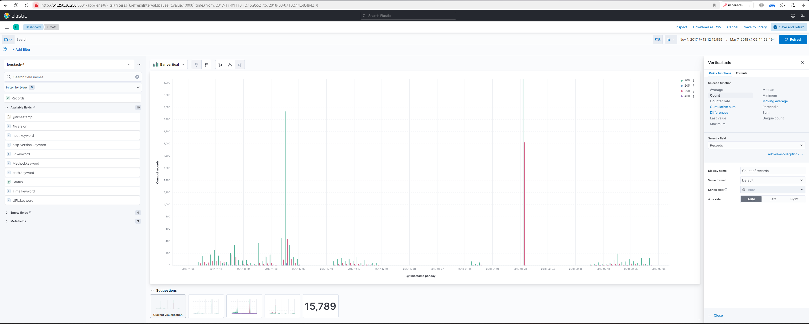

# elk

## 1. Запуск контейнеров

```
# переходим в директорию проекта
cd ~/.docker/elk

# запускаем сервисы elasticsearch и kibana
docker compose up
```

### 2. Запуск парсера и отправка результата в Elasticsearch

```
docker run --rm --name logstash --net elk_elastic -v $(pwd)/logstash:/app -it logstash:7.17.23 logstash -f /app/clickstream.conf
```

### 3. Результат парсинга

После всех преобразований сообщения из csv файла выглядят так:

```
...
{
            "host" => "63f6ad1ecd83",
    "http_version" => "1.1",
            "Time" => "02/Mar/2018:15:46:44",
             "URL" => "/allsubmission.php",
            "path" => "/app/weblog.csv",
         "message" => "10.128.2.1,[02/Mar/2018:15:46:44,GET /allsubmission.php HTTP/1.1,200\r",
          "Method" => "GET",
          "Status" => 200,
              "IP" => "10.128.2.1",
      "@timestamp" => 2018-03-02T15:46:44.000Z,
        "@version" => "1"
}
{
            "host" => "63f6ad1ecd83",
    "http_version" => "1.1",
            "Time" => "02/Mar/2018:15:46:48",
             "URL" => "/showcode.php?id=313&nm=abc145",
            "path" => "/app/weblog.csv",
         "message" => "10.128.2.1,[02/Mar/2018:15:46:48,GET /showcode.php?id=313&nm=abc145 HTTP/1.1,200\r",
          "Method" => "GET",
          "Status" => 200,
              "IP" => "10.128.2.1",
      "@timestamp" => 2018-03-02T15:46:48.000Z,
        "@version" => "1"
}
...
```

### 4. Дашборд в Kubana

В резуьтате из лога удалось вытянуть 15789 полезных записей:

<a href="screenshot/kibana.png" target="_blank"></a>